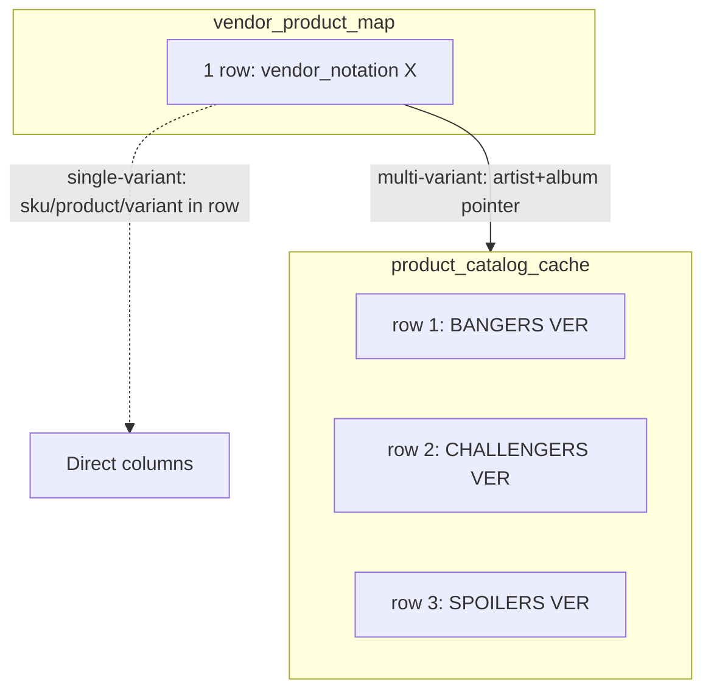
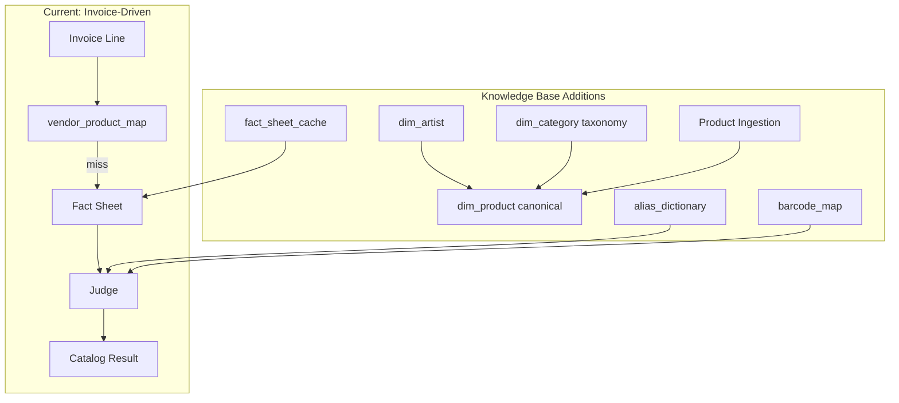
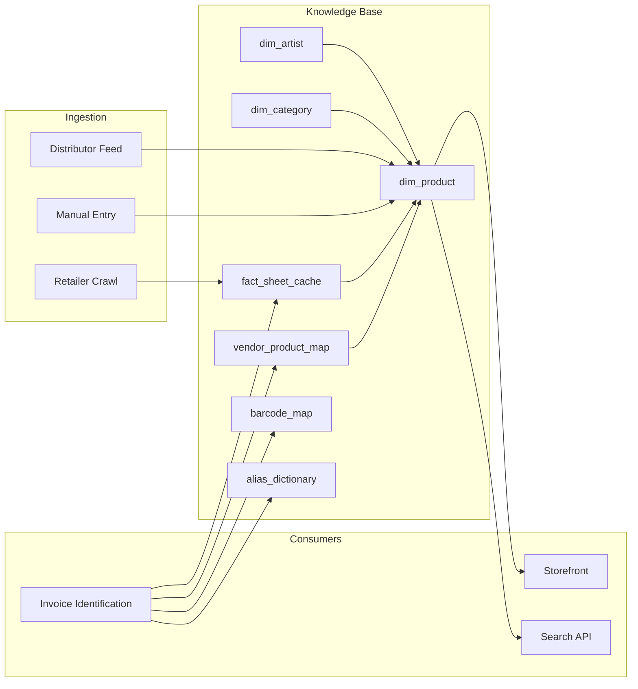

# K-Pop Product Knowledge Base — Expansion Plan

Your current system is **invoice-driven**: vendor notation → research → judge → catalog. It learns products only when invoices arrive. A **knowledge base** would store and serve product data proactively, supporting invoice matching, storefronts, search, and automation.

---

## What You Already Have

| Capability                  | Current State                                                                                     |
| --------------------------- | ------------------------------------------------------------------------------------------------- |
| **Product ontology**        | Product → Variant → SKU; canonical naming rules ([PRODUCT_ONTOLOGY.md](docs/PRODUCT_ONTOLOGY.md)) |
| **Vendor notation mapping** | `dim_vendor_product_map` — vendor_notation → product (learned from invoices)                      |
| **Multi-variant catalog**   | `dim_product_catalog_cache` — full variant set per (vendor, artist, album)                        |
| **Fact sheet**              | artist, album, release_type, packaging, versions, retailer_sources, evidence                      |
| **Research pipeline**       | Perplexity/DuckDuckGo → fact sheet (reactive, per invoice)                                        |
| **dim_product schema**      | Exists with `upc`, `release_date`, `msrp`, `standard_category_id`, `metadata` — mostly unused     |
| **dim_category schema**     | Exists — not wired into product identification                                                    |

---

## Cache Data Model: Granularity Difference (Critical)

Two tables with different granularities and roles:

| Table                         | Granularity                       | Purpose                                                                                                                                                                                                          |
| ----------------------------- | --------------------------------- | ---------------------------------------------------------------------------------------------------------------------------------------------------------------------------------------------------------------- |
| **dim_product_catalog_cache** | **One row per variant** (per SKU) | Stores the full catalog: (vendor_id, artist, album) → N variant rows (BANGERS VER, CHALLENGERS VER, …). Latest `catalog_generation` per key wins.                                                                |
| **dim_vendor_product_map**    | **One row per vendor_notation**   | Maps vendor text → product. Can imply **multiple variants**: single-variant stores sku/product/variant directly; multi-variant stores (artist, album, invoice_entry_skus) and fetches N rows from catalog cache. |

**Implications for KB design:**

1. **dim_product (canonical)** should mirror catalog cache granularity: **one row per variant/SKU**, not one row per logical product. This aligns with how catalog cache and vendor matching work (quantity split across variants).
2. **Product families** (artist + album + format) are implicit: group rows by (product_name, standard_product_id). A "product" with 5 variants = 5 rows in both catalog cache and dim_product.
3. ** vendor_product_map** stays as the **invoice-facing layer** — it points to the catalog. For a vendor-agnostic KB, dim_product holds the canonical variant list; vendor_product_map links vendor notation → those variants (via catalog cache today, or direct dim_product lookup later).
4. **Fact sheet cache** (product-centric) would key on (artist, album, packaging) and return a **list of variants** — same shape as catalog cache, but without vendor_id.

---

## Gaps for a Full Knowledge Base

---

## 1. Canonical Product Catalog (`dim_product`)

**Goal**: A single source of truth for products, populated *before* invoices arrive.

**Granularity**: **One row per variant** (same as `dim_product_catalog_cache`). One product (e.g. IVE REVIVE+ Photobook) with 5 variants = 5 rows. This matches how catalog cache and vendor_product_map work (multi-variant = N rows, quantity split across them).

| Addition                   | Purpose                                                                                                                                                                                 |
| -------------------------- | --------------------------------------------------------------------------------------------------------------------------------------------------------------------------------------- |
| **Populate `dim_product`** | Today: vendor_product_map + catalog cache store mappings; dim_product is unused. KB needs canonical variant records.                                                                    |
| **Fields to use**          | `standard_product_id`, `product_name`, `variant_name`, `sku`, `upc`/barcode, `release_date`, `msrp`, `standard_category_id`, `metadata` (artist, album, packaging)                      |
| **vs catalog_cache**       | Catalog cache is vendor-scoped (vendor_id, artist, album). dim_product is vendor-agnostic — canonical variant list. Catalog cache can reference dim_product by sku/standard_product_id. |

**Implementation**: After Judge produces `catalog_entries`, upsert into `dim_product` (one row per entry). Catalog cache continues to store vendor-specific learned data; dim_product becomes the shared variant registry. Add a "product-first" path: ingest from distributor feeds or manual entry → populate dim_product → invoice matching resolves to it.

---

## 2. Product Category Taxonomy

**Goal**: Classify products beyond ad-hoc naming (ALBUM, MAGAZINE, LIGHTSTICK, CONCERT_MERCH, etc.).

| Category Type | Examples                        |
| ------------- | ------------------------------- |
| ALBUM         | Photobook, Digipack, Jewel Case |
| MAGAZINE      | ELLE JAPAN, Singles             |
| LIGHTSTICK    | Official light sticks           |
| MERCHANDISE   | Playcode, MD, concert goods     |
| SEASONAL      | Season’s greetings, diaries     |

**Implementation**: Seed `dim_category` with K-pop taxonomy. Add `product_category` to fact sheet and Judge output. Use `standard_category_id` in `dim_product` for filtering and reporting.

---

## 3. Artist / Group Entity (`dim_artist`)

**Goal**: Normalize artist names and support member-level variants.

| Use Case        | Benefit                                    |
| --------------- | ------------------------------------------ |
| Member variants | Link "YUJIN VER" to IVE’s member roster    |
| Aliases         | BTS ↔ Bangtan Sonyeondan, SKZ ↔ Stray Kids |
| Sub-units       | NCT 127, NCT DREAM, NCT U, NCT WISH        |

**Schema (conceptual)**:

- `standard_artist_id`, `artist_name`, `aliases[]`, `group_id` (for sub-units), `members[]` (for member variants)

**Implementation**: New `dim_artist` table. Extend fact sheet with `artist_id` or verified artist name. Judge can validate member variants against artist roster.

---

## 4. Alias / Vendor Notation Dictionary

**Goal**: Normalize vendor shorthand before AI (mentioned in [kpop_product_normalization_architecture.md](docs/kpop_product_normalization_architecture.md) Section 4.1) but not implemented.

| Example         | Canonical     |
| --------------- | ------------- |
| digitpack, dp   | digipack      |
| rnd, random ver | random        |
| 2nd full        | 2ND ALBUM     |
| PB ver          | PHOTOBOOK VER |

**Implementation**: `alias_dictionary` table: `alias_text`, `canonical_text`, `confidence`, `context` (optional: album, vendor). Add pre-processing step in [main.py](cloud_function/main.py) before cache lookup. Reduces research needs and improves cache hits.

---

## 5. Fact Sheet Cache (Product-Centric)

**Goal**: Cache research by `artist + album + packaging` so identical products skip research even across vendors.

| Current                                                       | Proposed                                                              |
| ------------------------------------------------------------- | --------------------------------------------------------------------- |
| Cache key: `vendor_id + vendor_notation` (vendor_product_map) | Add key: `artist                                                      |
| Learned only from invoice resolution                          | Can be pre-populated from distributor catalogs                        |
| catalog_cache: one row per variant, vendor-scoped             | fact_sheet_cache: returns list of variants (same shape), no vendor_id |

**Implementation**: New `fact_sheet_cache` table or a vendor-agnostic view over catalog cache. Output: list of `{sku, product_name, variant_name, standard_product_id}` per product (same structure as catalog cache rows). Before Research, check product-centric cache. Saves Perplexity cost and speeds up identification.

---

## 6. Barcode / UPC Resolution

**Goal**: Map barcodes to `standard_product_id` for receiving, scanning, and vendor-agnostic matching.

**Implementation**: `barcode_product_map` table: `barcode`, `standard_product_id`, `sku`, `source`. Populate from: (a) distributor feeds, (b) manual entry, (c) extraction from fact sheet evidence when available. Add barcode lookup step before vendor cache in pipeline.

---

## 7. Proactive Product Ingestion

**Goal**: Add products to the KB without waiting for invoices.

| Source              | Data                                   | Flow                                                          |
| ------------------- | -------------------------------------- | ------------------------------------------------------------- |
| Distributor catalog | CSV/Excel with product names, barcodes | Batch job → fact sheet (or manual) → Judge → dim_product      |
| Retailer scrapers   | ktown4u, yesasia, music plaza          | Scheduled crawl → fact sheet → Judge → dim_product            |
| Manual entry        | Form/UI                                | Human provides fact sheet → Judge → dim_product               |
| Release calendars   | Coming soon albums                     | Pre-register product shell → fill variants when details known |

**Implementation**: New ingestion pipeline (Cloud Function or batch job). Input: fact sheet or structured product data. Output: upsert to `dim_product`, optionally to `fact_sheet_cache`.

---

## 8. Query / Search API

**Goal**: Expose the KB for search, autocomplete, and product lookup.

| Endpoint                                 | Purpose                       |
| ---------------------------------------- | ----------------------------- |
| `GET /products?artist=IVE&album=REVIVE+` | List products by artist/album |
| `GET /products?q=REVIVE+`                | Full-text or fuzzy search     |
| `GET /products/:id`                      | Product detail with variants  |
| `GET /artists`                           | List artists (for filters)    |
| `GET /products?category=ALBUM`           | Filter by category            |

**Implementation**: New Cloud Function or API layer. Query `dim_product` (one row per variant). For "product detail with variants", group by `product_name` or `standard_product_id` (products sharing the same base product have different variant rows). No need for catalog cache in search — dim_product holds the canonical variant list. Add search index (e.g., BigQuery full-text, or external like Typesense/Algolia) if needed.

---

## 9. Enriched Product Metadata

**Goal**: Store structured details for storefronts and decision support.

| Field           | Example                              | Use                                   |
| --------------- | ------------------------------------ | ------------------------------------- |
| `contents`      | photocard ×1, poster ×1, sticker set | Product page, inventory notes         |
| `release_date`  | 2024-09-15                           | Sorting, "new releases"               |
| `pob_suffixes`  | APPLE MUSIC, SW, KTown4u             | Variant resolution; currently ignored |
| `member_roster` | For member digipacks                 | Validate variant names                |

**Implementation**: Extend `metadata` JSON in `dim_product` or add columns. Enrich fact sheet and Judge output with these when research provides them.

---

## 10. Architecture Summary

**Two-layer variant model:**

- **dim_product** (canonical): one row per variant, vendor-agnostic. Source for search, storefront, barcode map.
- **dim_product_catalog_cache** (vendor-learned): one row per variant, scoped by (vendor_id, artist, album). Populated when vendor_product_map learns a multi-variant mapping. Can sync from dim_product or remain vendor-specific.
- **vendor_product_map**: one row per notation; points to either direct columns (single) or catalog cache (multi).

---

## Recommended Implementation Order

| Phase | Scope                                                       | Effort                                           |
| ----- | ----------------------------------------------------------- | ------------------------------------------------ |
| **1** | Alias dictionary + pre-processor                            | Low — immediate cache hit improvement            |
| **2** | Populate and use `dim_product` from Judge output            | Low — persist catalog entries to canonical table |
| **3** | Product category taxonomy + `standard_category_id` in Judge | Low                                              |
| **4** | Fact sheet cache (product-centric key)                      | Medium                                           |
| **5** | `dim_artist` + alias resolution                             | Medium                                           |
| **6** | Barcode map + lookup step                                   | Medium                                           |
| **7** | Product ingestion pipeline (manual first, then distributor) | Medium–High                                      |
| **8** | Query/Search API                                            | Medium                                           |
| **9** | Enriched metadata, POB handling                             | Lower priority                                   |

---

## Files to Modify / Create

| File                                                             | Change                                                           |
| ---------------------------------------------------------------- | ---------------------------------------------------------------- |
| [cloud_function/main.py](cloud_function/main.py)                 | Add alias pre-processing; optionally barcode lookup before cache |
| [cloud_function/cache.py](cloud_function/cache.py)               | Fact sheet cache lookup; dim_product upsert                      |
| [cloud_function/judge_prompt.py](cloud_function/judge_prompt.py) | Add product_category to output                                   |
| [cloud_function/fact_sheet.py](cloud_function/fact_sheet.py)     | Add `product_category`, `barcode` when available                 |
| `bigquery/create_alias_dictionary.sql`                           | New table                                                        |
| `bigquery/create_fact_sheet_cache.sql`                           | New table (or extend existing)                                   |
| `bigquery/create_dim_artist.sql`                                 | New table                                                        |
| `bigquery/create_barcode_product_map.sql`                        | New table                                                        |
| New: `cloud_function/product_ingestion.py`                       | Batch/manual product ingestion                                   |
| New: `cloud_function/search_api.py` or similar                   | Query endpoints                                                  |

---

## Design Principle (from your docs)

> "Do NOT build an invoice parser. Build a **K‑Pop Product Knowledge System**."

The invoice pipeline remains the main real-world signal, but the KB becomes the shared source of truth. Invoices feed the KB (via vendor_product_map and dim_product), and the KB feeds invoice matching (via alias, barcode, fact sheet cache) and future applications (search, storefront, analytics).