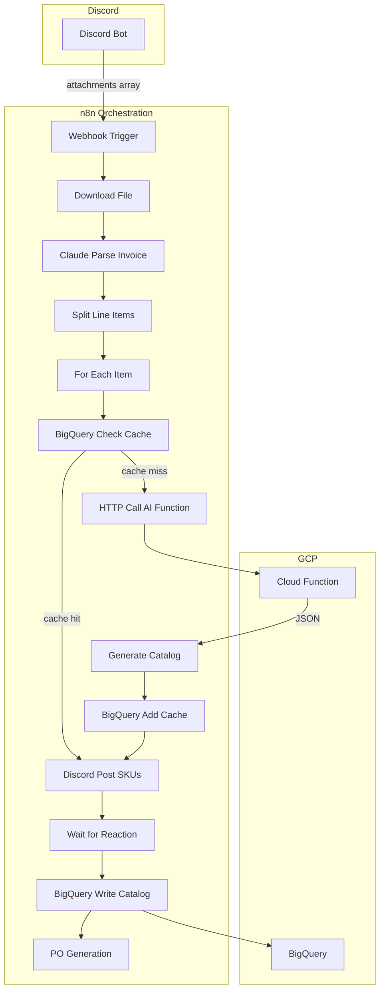

# KpopNara Invoice-to-Catalog Automation — Implementation Plan

## Current State

- **Discord bot** ([bot.py](bot.py)): Captures one message that may include multiple files (attachments). Forwards invoice attachments to n8n webhook. Currently sends **one webhook per attachment** (loops and POSTs each file separately), which causes multiple replies and fragmented reactions.
- **n8n**: Deployed and ready (webhook URL exists)
- **GCP**: Will host Cloud Function + BigQuery

---

## Architecture Overview




---

## AI Layer — Parse Line Items + Web Search Identification

The AI layer has two distinct steps: (1) **parse** the invoice into structured line items, and (2) **identify** each line item via web search to map vendor notation to the correct catalog product.

### AI Step 1: Parse Invoice → Line Items

**Where**: n8n HTTP node → Claude Vision API (or Cloud Function if n8n can't handle binary)

**Input**: Invoice image (PNG/JPEG) or PDF as base64. For PDFs, convert first page to image or use Claude's PDF support if available.

**Claude prompt** (structured extraction):

```
Extract all line items from this K-pop vendor invoice. Return ONLY valid JSON, no markdown.

For each line item, extract:
- vendor_notation: The exact product description as written on the invoice (e.g. "BTS MOTS7 Ver4 CD", "SEVENTEEN FML Fallen Ver")
- quantity: integer
- unit_price: number
- total_price: number
- line_number: optional, for ordering

Also extract from invoice header:
- vendor_name: Vendor/seller name
- invoice_number: if present
- invoice_date: if present

Return this exact structure:
{
  "vendor_name": "...",
  "invoice_number": "...",
  "invoice_date": "...",
  "line_items": [
    { "vendor_notation": "...", "quantity": 1, "unit_price": 18.50, "total_price": 18.50 }
  ]
}
```

**Output**: Structured JSON. n8n Code node or Split Out node splits `line_items` into individual items for the loop.

**Edge cases**: Handle multi-page invoices (parse each page, merge line items); handle tables with merged cells; normalize vendor_notation (trim whitespace, preserve original casing for cache lookup).

---

### AI Step 2: Web Search → Identify Correct Product

**Where**: Python Cloud Function `identify_and_generate` (gemini with tool use)

**Input** (per line item): `vendor_notation`, `vendor_name`

**Key concept — vendor_notation implies multiple variants**: A single invoice line item (e.g. "BTS MOTS7 Ver4 CD", qty: 10) refers to **one** variant, but that notation implies a **product family** with multiple variants. BTS MOTS7 has Ver 1, Ver 2, Ver 3, Ver 4 — the invoice shows only Ver 4, but the AI must discover and return **all** variants for the catalog. This enables: (1) correct matching of the invoice line to the right variant SKU, (2) populating the catalog with the full product family for future lookups, and (3) cache entries that cover the whole product, not just the one line.

**Flow** (agent loop inside Cloud Function):

1. gemini **receives** `vendor_notation` (e.g. "BTS MOTS7 Ver4 CD")
2. gemini **calls** `web_search` tool with queries like:
  - "BTS Map of the Soul 7 Version 4 CD album"
  - "BTS MOTS7 version 4 kpop album"
3. gemini **analyzes** search results (product pages, album listings, images)
4. gemini **uses vision** (if product images in search results) to confirm which variant matches (e.g. Ver 4 cover art)
5. gemini **returns** structured JSON with:
  - `matched_sku` — the specific variant SKU for this invoice line
  - `catalog_entries` — all variants found (for cache and future lookups)
  - `confidence`, `evidence`

**System prompt** (KpopNara naming convention):

```
You are a K-pop product identification specialist for KpopNara.

CATALOG NAMING:
  Product name: {ARTIST} - {Album Name} ({Version}) [{Format}]
  SKU pattern:  {ARTIST_CODE}-{ALBUM_CODE}-{VERSION}

EXAMPLES:
  BTS - Map of the Soul: 7 (Version 4) [CD]  →  BTS-MOTS7-V4
  SEVENTEEN - FML (Ver. Fallen) [CD]          →  SVT-FML-FALLEN
  NewJeans - How Sweet (Weverse Ver.) [CD]   →  NJ-HOWSWEET-WEVERSE

Your job:
1. Search the web to identify the official product from vendor_notation
2. vendor_notation often implies a product family with multiple variants (e.g. "Ver4" means Version 4 of an album that has Ver 1–4). Even though the invoice shows only ONE line item, discover ALL variants that exist for that product
3. Find product pages with images; use vision to determine exact version/variant and distinguish between variants
4. Match the invoice line to the correct variant SKU (the one actually on the invoice)
5. Return catalog entries for ALL variants in our naming convention; mark the invoice item with is_invoice_item: true
```

**Web search strategy**:

- First query: artist + album from vendor notation
- Second query: add "version 4" or variant keyword if present
- Use image URLs from search results; pass to gemini vision to distinguish variants (e.g. different album covers)
- Make sure to split all variants (version 4 might imply it contains 4 kinds of variants in that version)

**Output** (aligned with `vendor_product_map` and `fact_purchase_order_item`):

```json
{
  "vendor_notation": "BTS MOTS7 Ver4 CD",
  "matched_sku": "BTS-MOTS7-V4",
  "matched_product_name": "BTS - Map of the Soul: 7 (Version 4) [CD]",
  "standard_product_id": "generated-or-existing-uuid",
  "confidence": 0.95,
  "evidence": "Web search found official BTS MOTS7 product page; cover art matches Version 4",
  "catalog_entries": [
    { "sku": "BTS-MOTS7-V1", "product_name": "...", "is_invoice_item": false },
    { "sku": "BTS-MOTS7-V4", "product_name": "...", "is_invoice_item": true }
  ]
}
```

**Implementation note**: Use Claude's `web_search_20250305` tool with `max_uses: 5` so the model can run multiple searches (e.g. broad search, then narrow by variant). Handle tool-use loop: if Claude returns `tool_use` blocks, execute the tool and append results to messages, then continue until Claude returns a final text response with JSON.

---

## Phase 1 — n8n + Parse (3–5 days)

### 1.1 BigQuery — Use Existing Tables + New Cache

**Dataset**: `etl_data` (existing)

**Existing tables** (from [schemas/](schemas/)):


| Table                               | Purpose                                                                                                                                                              |
| ----------------------------------- | -------------------------------------------------------------------------------------------------------------------------------------------------------------------- |
| `etl_data.dim_product`              | Product catalog — `standard_product_id`, `sku`, `product_name`, `variant_name`, `upc`, `standard_vendor_id`, `release_date`, `metadata`                              |
| `etl_data.dim_vendor`               | Vendors — `standard_vendor_id`, `vendor_name`                                                                                                                        |
| `etl_data.dim_purchase_order`       | PO header — `po_id`, `po_number`, `standard_vendor_id`, `status`, `total_amount`, `order_date`                                                                       |
| `etl_data.fact_purchase_order_item` | PO line items — `po_item_id`, `po_id`, `standard_product_id`, `product_name`, `variation_name`, `sku`, `quantity_ordered`, `unit_price`, `total_price`, `is_matched` |


**New table** — `etl_data.vendor_product_map` (cache for vendor notation → SKU):

```sql
CREATE TABLE etl_data.vendor_product_map (
  standard_vendor_id  STRING,      -- FK to dim_vendor
  vendor_notation     STRING,      -- e.g. "BTS MOTS7 Ver4 CD"
  standard_product_id STRING,     -- FK to dim_product
  sku                 STRING,      -- e.g. "BTS-MOTS7-V4"
  product_name        STRING,      -- KpopNara format
  confidence          FLOAT64,
  verified_by         STRING,       -- "human" or "ai"
  created_at          TIMESTAMP,
  updated_at          TIMESTAMP
);
```

Add [schemas/vendor_product_map.json](schemas/vendor_product_map.json) in the same format as other schemas for consistency.

**Lookup flow**: Query `vendor_product_map` by `standard_vendor_id` + `vendor_notation` → get `standard_product_id` / `sku`. If miss, call AI function, then insert new mapping.

**Vendor resolution**: Invoice parse extracts vendor name text. Map to `standard_vendor_id` via `dim_vendor.vendor_name` (fuzzy match or manual mapping). Add `standard_vendor_id` to webhook payload if known from context.

### 1.2 Multi-File Handling (Discord Message with Multiple Attachments)

A single Discord message can contain multiple invoice files (e.g., 3 PDFs from the same vendor). The system must:

- **Bot**: Collect all valid attachments and send **one webhook** with an `attachments` array
- **n8n**: Loop over each attachment, parse each, then merge all line items for downstream processing

**Bot payload shape (single POST per message):**

```json
{
  "attachments": [
    { "attachment_url": "...", "filename": "invoice1.pdf", "content_type": "application/pdf", "file_size": 12345 },
    { "attachment_url": "...", "filename": "invoice2.pdf", "content_type": "application/pdf", "file_size": 67890 }
  ],
  "channel_id": "...",
  "message_id": "...",
  "author": "...",
  "message_content": "..."
}
```

**Bot behavior**: Add 🔄 once at start, send one webhook with all attachments, post one consolidated reply, update to ✅/❌ once when done.

### 1.3 n8n Workflow — Invoice Parse

Build workflow triggered by **Webhook** (receives from Discord bot):

1. **Webhook** — Receives `attachments` array, `message_id`, `channel_id`, etc.
2. **Split Out** — Split `attachments` into individual items (Loop / SplitInBatches)
3. **For each attachment**:
  - **HTTP Request** — Download file from `attachment_url` (Discord CDN URLs are usually public; if auth needed, bot can send base64 instead)
  - **IF** — Has attachment? (validate)
  - **HTTP Request** — Call Claude API (vision) to parse invoice:
  - Send image as base64
  - Prompt: Extract line items (product description, qty, price, vendor notation)
  - Return structured JSON
  - **Code/Split** — Split response into array of line items
4. **Merge** — Aggregate all line items from all attachments into one array (n8n Merge node or Code node)
5. **BigQuery** — For each line item, query `etl_data.vendor_product_map` (by `standard_vendor_id` + `vendor_notation`) for cached match
6. **Merge** — Combine cached results; items not in cache go to Phase 2 path (or post "needs AI" for now)

**Claude API config**: Use Anthropic HTTP node. Model: `claude-sonnet-4-5-20250929` (or latest). Pass image + extraction prompt.

**n8n workflow JSON deliverable** — Phase 1.3 must produce a valid **n8n workflow JSON file** that can be imported into n8n:

- **Export format**: n8n workflow export (JSON). Build the workflow in n8n, then export via n8n UI (Workflow → Export) or API. The file must be valid n8n workflow schema (nodes, connections, settings, credentials placeholders).
- **File location**: e.g. `workflows/invoice-parse-phase1.json` in the repo
- **Import**: User can import via n8n UI (Import from File) or CLI: `n8n import:workflow --input=workflows/invoice-parse-phase1.json`
- **Self-contained**: Workflow JSON must include all nodes (Webhook, Split Out, HTTP, Claude/Anthropic, Code, Merge, BigQuery). Use credential placeholders so users attach their own credentials after import.
- **Documentation**: Add a short README or plan note on required credentials (Anthropic, BigQuery, Discord) and env vars before importing.

### 1.4 Discord Bot Adjustment — Multi-File (Required)

**Current issue**: Bot sends one webhook per attachment, causing multiple replies and reactions.

**Change**: Batch all valid attachments into a single payload and send one webhook per message.

- Collect all valid attachments (filter by type: png, jpg, webp, pdf, xlsx, xls)
- Build `attachments` array with `{ attachment_url, filename, content_type, file_size }` per item
- Add 🔄 once before the POST
- Send one POST with full payload
- Handle response once: one reply, one ✅/❌ reaction

**Optional (base64 fallback)**: If Discord CDN blocks n8n, bot can download each file and send `attachment_base64` instead of `attachment_url`.

---

## Phase 2 — AI Cloud Function (1–2 weeks)

### 2.1 Cloud Function — `identify_and_generate`

Create new directory `cloud_function/` in repo (or separate repo):

**File structure:**

```
cloud_function/
  main.py
  requirements.txt
```

`**main.py**` (~200 lines):

- `@functions_framework.http` entry point
- Receives POST JSON: `vendor_notation`, `vendor_name`, optional `invoice_image_b64`
- Calls Claude API with:
  - `web_search_20250305` tool (max_uses: 5)
  - System prompt with KpopNara naming convention (from architecture doc)
  - User prompt: Identify product, find all variants, return catalog entries
- Returns JSON (aligned with `dim_product` / `fact_purchase_order_item`):

```json
{
  "vendor_notation": "...",
  "identified_product": { "artist", "album", "matched_version", "confidence", "evidence" },
  "catalog_entries": [
    {
      "product_name": "ARTIST - Album (Version) [Format]",
      "sku": "ARTIST-ALBUM-VER",
      "standard_product_id": "uuid or generated id",
      "variant_name": "...",
      "upc": "...",
      "is_invoice_item": true,
      "image_url": "..."
    }
  ]
}
```

- Helper: `extract_json_from_response()` to parse Claude output

`**requirements.txt**`: `functions-framework`, `anthropic`

**Deploy**: `gcloud functions deploy identify_and_generate --gen2 --runtime python311 --trigger-http --allow-unauthenticated` (or use IAM for n8n)

### 2.2 n8n Workflow — Cache Miss Path

Extend Phase 1 workflow:

1. After **BigQuery Check Cache** — **IF** item not in cache:
2. **HTTP Request** — POST to Cloud Function URL with `vendor_notation`, `vendor_name`
3. **Code** — Extract `catalog_entries`, pick matched SKU
4. **BigQuery** — Insert into `etl_data.vendor_product_map` (new mapping)
5. **Merge** with cache-hit path

### 2.3 Discord Review Flow

1. **Discord: Send Message** — Post SKUs for review in thread (create thread from original message). When multiple files were processed, include a consolidated summary (e.g., "3 invoices, 15 line items") and group by source file if helpful.
2. **Discord: Wait for Reaction** — Wait for ✅ or ❌ on the message
3. **IF** reaction is ✅:
  - **BigQuery: Insert** — Write to `etl_data.dim_purchase_order` (PO header) and `etl_data.fact_purchase_order_item` (line items). New products → `etl_data.dim_product`.
4. **IF** reaction is ❌:
  - Post "Please correct" or collect correction (optional: store correction for re-learning)

**n8n Discord node**: Requires Discord app credentials. Create Discord app, get bot token, add to n8n credentials. Use "Send Message" and "Wait for Reaction" (or "Trigger on Reaction") nodes.

---

## Phase 3 — Auto-Creation for New Products (1–2 weeks)

### 3.1 Extend Cloud Function

When product is **not** in catalog at all:

- AI creates **draft** catalog entry from web search + images
- Return `catalog_entries` with `is_draft: true`, `confidence`
- Include `variant_distinguishing_features`, `image_urls`, `release_date`

### 3.2 n8n — Draft Handling

1. **IF** Cloud Function returns `is_draft: true` or new product:
2. **Discord: Post** — Show draft entry, ask for approval/correction
3. **Wait for Reaction** — Same as Phase 2
4. **BigQuery** — Insert into catalog (and vendor_product_map) on approval

### 3.3 Create New Products in Thrive (Internal API)

When a new product is approved and written to `etl_data.dim_product`, it must also be created in **Thrive** via their internal API so the product is available in the POS/inventory system.

- **Trigger**: After BigQuery insert of new product (from draft approval or Phase 2 write)
- **Integration**: Call Thrive internal API to create product + variants
- **Flow**:
  1. For each new `dim_product` row (or `catalog_entries` with `is_draft: true` that was approved)
  2. **HTTP Request** — POST to Thrive API (product create endpoint). Payload: product name, SKU, UPC, variant info, etc. (align with Thrive API schema)
  3. **Store IDs** — Thrive returns `thrive_product_id`, `thrive_variant_id`. Update `dim_product` (or `dim_luminate_product`) and `fact_purchase_order_item` with these IDs for sync tracking
  4. **Error handling** — If Thrive API fails, log to `etl_process_logs`, post alert to Discord, optionally retry
- **Implementation options**:
  - **n8n HTTP node** — If Thrive API is REST and n8n can authenticate (API key, OAuth). Add Thrive credentials to n8n.
  - **Cloud Function** — If Thrive API requires complex auth or custom logic, wrap in a small Python/Node function called by n8n
- **Schema alignment**: `dim_product`, `fact_purchase_order_item`, `dim_luminate_product` already have `thrive_product_id`, `thrive_variant_id`, `added_to_thrive_date` — use these for sync state

### 3.4 Confidence Thresholds (Optional)

- High confidence (>0.95): Auto-add to cache, still post for review
- Low confidence (<0.7): Always require human confirmation
- Configurable via n8n expression or env var

---

## Phase 4 — PO Generation (3–5 days)

### 4.1 n8n Nodes for PO

1. After **BigQuery Write Catalog** (on ✅ approval):
2. **Code** or **Google Docs** node — Build PO from approved invoice data:
  - Vendor, line items (SKU, qty, price), totals
3. **Template** — Use docx or PDF template (e.g., `docxtpl`-style or n8n's built-in)
4. **Output** — Save to GCS, or send via email/Slack

**Options:**

- **n8n Google Docs node** — Create doc from template
- **HTTP to Cloud Function** — If complex templating, small Python function to generate docx/PDF
- **n8n Code node** — Use `docx` or `pdf-lib` in Node.js (if n8n supports)

### 4.2 PO Template

Define PO template (docx or HTML):

- Header: Vendor, date, PO number
- Table: SKU, product name, qty, unit price, total
- Footer: Terms, signature block

---

## Environment & Secrets


| Variable                | Where               | Purpose                     |
| ----------------------- | ------------------- | --------------------------- |
| `ANTHROPIC_API_KEY`     | Cloud Function, n8n | Claude API                  |
| `DISCORD_BOT_TOKEN`     | Discord bot         | Bot auth                    |
| `N8N_WEBHOOK_URL`       | Discord bot         | Forward to n8n              |
| GCP service account     | n8n, Cloud Function | BigQuery access             |
| Discord app credentials | n8n                 | Send message, wait reaction |
| `THRIVE_USERNAME`       | n8n, Cloud Function | Thrive API auth (basic)     |
| `THRIVE_PASSWORD`       | n8n, Cloud Function | Thrive API auth (basic)     |


---

## Deliverables Summary


| Phase | Deliverables                                                                                  |
| ----- | --------------------------------------------------------------------------------------------- |
| 1     | BigQuery schema, n8n workflow JSON (importable), Claude invoice parse, cache lookup           |
| 2     | Cloud Function `identify_and_generate`, n8n cache-miss → AI → Discord review → BigQuery write |
| 3     | Draft product creation, n8n draft approval flow, Thrive API integration (create products)     |
| 4     | PO generation nodes in n8n, template (docx/PDF)                                               |


---

## Recommended Implementation Order

1. **Phase 1**: BigQuery tables → n8n webhook workflow → Claude parse → cache lookup. Validate end-to-end with a test invoice.
2. **Phase 2**: Deploy Cloud Function → wire n8n cache-miss path → Discord review → BigQuery write. Test with uncached product.
3. **Phase 3**: Extend Cloud Function for drafts → n8n draft flow.
4. **Phase 4**: Add PO generation after catalog write.

