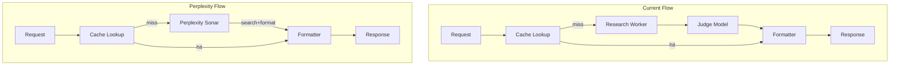

# Perplexity Agent Pipeline for Product Identification

## Current vs New Flow




**Key difference**: Perplexity performs web search and structured output in a single API call, replacing the two-step Research → Judge sequence.

---

## Implementation Plan

### 1. New cloud function folder: `cloud_function_perplexity/`

Create a **separate** cloud function deployment (no changes to existing [cloud_function/](cloud_function/)):

```
cloud_function_perplexity/
├── main.py              # identify_and_generate entry point (cache + Perplexity)
├── local_server.py      # Flask dev server (like cloud_function)
├── perplexity.py        # Perplexity API client, prompt, JSON schema
├── cache.py             # Copy from cloud_function (vendor_product_map, BigQuery)
├── formatter.py         # Copy from cloud_function (format_output, line_items)
├── sku_formatter.py     # Copy from cloud_function (derive_sku)
├── requirements.txt     # functions-framework, google-cloud-bigquery, requests, json5
└── Dockerfile           # Same pattern as cloud_function
```

**Shared modules**: Copy `cache.py`, `formatter.py`, `sku_formatter.py` from [cloud_function/](cloud_function/) so the new CF is self-contained. No imports from `cloud_function/`.

### 2. `perplexity.py` — Perplexity API client

- **Function**: `run_perplexity_identify(vendor_notation: str, vendor_name: str) -> dict`
- **API**: `POST https://api.perplexity.ai/chat/completions`
- **Model**: `sonar` or `sonar-pro` (configurable via `PERPLEXITY_MODEL`)
- **Auth**: `Authorization: Bearer {PERPLEXITY_API_KEY}`

**Request structure**:

- `messages`: `[{"role": "system", "content": "<condensed judge rules>"}, {"role": "user", "content": "Vendor notation: X\nVendor: Y\n\nIdentify product and return JSON."}]`
- `response_format`: JSON schema matching judge output
- `search_domain_filter`: Optional allowlist for K-pop retailers
- `max_tokens`: 4096, `temperature`: 0

**Response handling**: Parse `choices[0].message.content`; reuse `_extract_json` + json5 fallback for malformed output.

### 3. Condensed system prompt

Extract core rules from [judge.py](cloud_function/judge.py) into ~60–80 lines: canonical naming, variant rules, `catalog_entries`, confidence scale, [RANDOM].

### 4. `main.py` — Cache-first Perplexity pipeline

Same request/response contract as [cloud_function/main.py](cloud_function/main.py):

1. Cache lookup (unchanged)
2. On miss → `run_perplexity_identify` → `format_output`
3. On hit → return cached (uppercased)
4. Persist learning when confidence >= 0.7

No `IDENTIFY_PROVIDER` switch; this CF is Perplexity-only.

### 5. Docker and n8n integration

- **docker-compose.local.yml**: Add service `cloud-functions-perplexity` on port 8081, build from `cloud_function_perplexity/`
- **n8n**: Point "AI Identify Product" step to `http://cloud-functions-perplexity:8081/identify` when using the Perplexity workflow (or add workflow variable `IDENTIFY_URL` to choose `:8080` vs `:8081`)

### 6. Configuration


| Env var                          | Purpose                           |
| -------------------------------- | --------------------------------- |
| `PERPLEXITY_API_KEY`             | Required for Perplexity API       |
| `PERPLEXITY_MODEL`               | `sonar` (default) or `sonar-pro`  |
| `PERPLEXITY_SEARCH_DOMAINS`      | Optional K-pop retailer domains   |
| `GOOGLE_APPLICATION_CREDENTIALS` | BigQuery (same as cloud_function) |


### 7. Dependencies

`cloud_function_perplexity/requirements.txt`: `functions-framework`, `google-cloud-bigquery`, `requests`, `json5` — no LangChain.

---

## API Contract (unchanged)

The formatter and n8n expect the same output shape. Perplexity must produce a decision dict compatible with `format_output()`:

```python
{
  "vendor_notation": "...",
  "matched_sku": "ARTIST-ALBUM-VERSION",
  "matched_product_name": "ARTIST - ALBUM [FORMAT]",
  "standard_product_id": "uuid",
  "confidence": 0.0-1.0,
  "evidence": "...",
  "catalog_entries": [{"sku": "", "product_name": "", "variant_name": "", "is_invoice_item": bool}]
}
```

`format_output` will uppercase fields and derive SKUs via [sku_formatter.py](cloud_function/sku_formatter.py) as it does today.

---

## Cache Integration

- New CF uses **copy** of [cache.py](cloud_function/cache.py); same BigQuery tables (`vendor_product_map`, `dim_vendor`)
- Both `cloud_function/` and `cloud_function_perplexity/` write/read the same cache — compatible schema
- `save_vendor_mapping` runs after `format_output` when confidence >= 0.7

---

## Files to Create


| File                                         | Action                                                                                           |
| -------------------------------------------- | ------------------------------------------------------------------------------------------------ |
| `cloud_function_perplexity/main.py`          | **Create** — identify endpoint, cache + Perplexity + formatter (same contract as cloud_function) |
| `cloud_function_perplexity/local_server.py`  | **Create** — Flask server for local dev (identify only)                                          |
| `cloud_function_perplexity/perplexity.py`    | **Create** — Perplexity API, prompt, response_format schema, JSON parse                          |
| `cloud_function_perplexity/cache.py`         | **Copy** from cloud_function                                                                     |
| `cloud_function_perplexity/formatter.py`     | **Copy** from cloud_function                                                                     |
| `cloud_function_perplexity/sku_formatter.py` | **Copy** from cloud_function                                                                     |
| `cloud_function_perplexity/requirements.txt` | **Create** — functions-framework, google-cloud-bigquery, requests, json5                         |
| `cloud_function_perplexity/Dockerfile`       | **Create** — same pattern as cloud_function                                                      |


## Files to Modify


| File                       | Action                                                               |
| -------------------------- | -------------------------------------------------------------------- |
| `docker-compose.local.yml` | Add service `cloud-functions-perplexity` on port 8081                |
| `Makefile`                 | Update help to mention both CFs (optional)                           |
| n8n workflow               | Add variable or alternate node to call `:8081` when using Perplexity |


---

## Error Handling

- Perplexity API errors (4xx/5xx): log and return 500 with error message
- Malformed JSON: reuse `_extract_json` + json5 fallback from judge
- Missing `catalog_entries` or invalid structure: validate and fall back to `research_judge` path if `IDENTIFY_FALLBACK_ON_ERROR` is set (optional enhancement)

